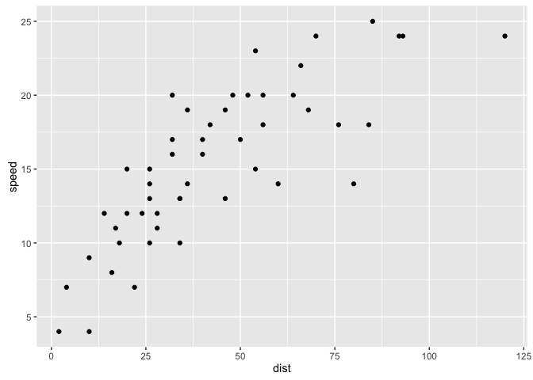

    library(dplyr)

    ## 
    ## Attaching package: 'dplyr'

    ## The following objects are masked from 'package:stats':
    ## 
    ##     filter, lag

    ## The following objects are masked from 'package:base':
    ## 
    ##     intersect, setdiff, setequal, union

    library(ggplot2)
    ggplot(cars, aes(dist, speed)) + geom_point()

  

    dplyr::filter(cars, speed == 4)

    ##   speed dist
    ## 1     4    2
    ## 2     4   10
